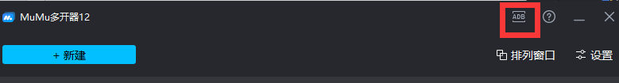
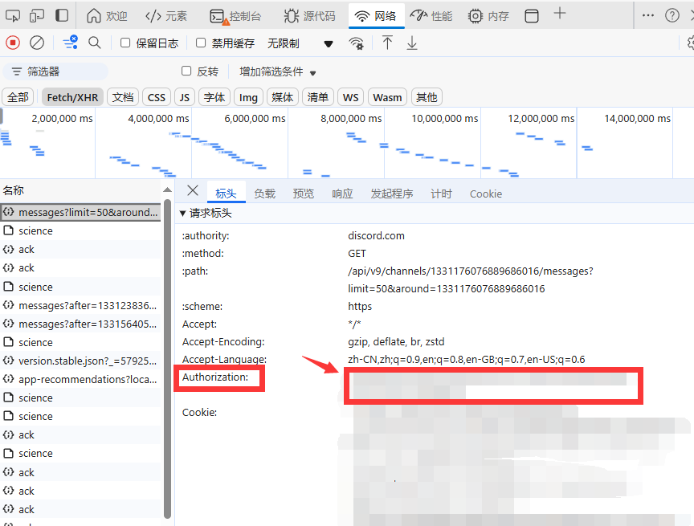
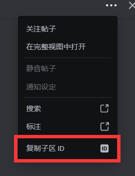
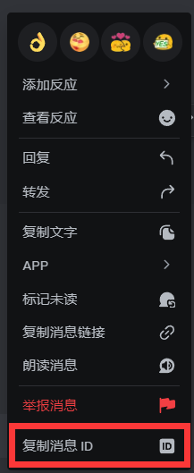

# **__PTCGPDiscordHost__**

*自动添加好友脚本*

*根据Discord帖子ID自动爬取回复，使用正则表达式获取16位好友码，通过ADB控制模拟器添加好友*

*本人是python新手，代码写得不够漂亮优雅，见谅*

# 环境部署

- Python >= 3.8.20

# 安装依赖

```sh
pip install -r requirements.txt
```

# 配置

*查看项目文件夹下的config.ini,并按照以下格式进行配置*
```ini
[HostSetting]
# 模拟器adb端口
adbport = 16672
# discord 个人凭证，相当于账号密码请勿泄露，推荐使用小号的token
token = 
# 网络代理 大陆玩家无法直接访问discord，需要配置代理
proxy = http://127.0.0.1:7890

# 帖子配置，channel- 后面的ID也要修改，可以有多个channel配置，同时host多个帖子，但并未测试
[channel-1332570752460918827]
# 帖子ID 
id = 1332570752460918827
# 消息ID 标记位，只会爬取这一条消息后的数据，不填就是从头开始拉取，代码运行过程中会自动更新消息ID
lastmessageid = 
# 一次爬取的数据量，后台写死10了，我觉得也挺好，懒得再改了
limit = 10


```

*adb端口获取*



*token获取*

*使用浏览器登录discord，按F12打开控制台，点击网络选项卡，筛选器选择 fetch/XHR，点选带有messgae字样的请求，并在图示位置获取TOKEN*

**再次警告！token相当于账号密码，请勿泄露，推荐使用小号的token，当然小号需要有查看对应帖子的权限，如果因为泄露token导致账号被盗，本人不负责**

**因此，为了避免账号纠纷，我不会提供打包后的exe文件，也请不要使用不信任的人提供的exe文件**



*帖子ID获取*



*消息ID获取*

